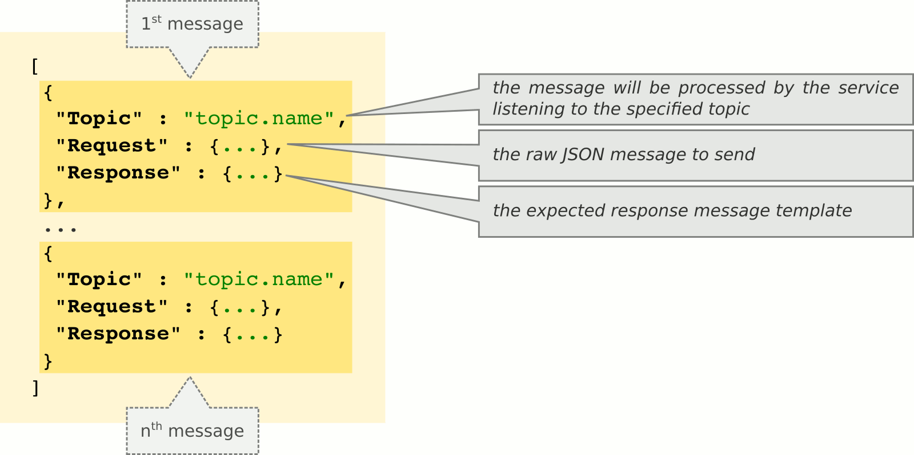

# natstest

*NATS Bus Test Component*

[](https://github.com/miracl/natstest/tree/master)
[](https://travis-ci.org/miracl/natstest?branch=master)
[](https://coveralls.io/github/miracl/natstest?branch=master)

[](https://github.com/miracl/natstest/tree/develop)
[](https://travis-ci.org/miracl/natstest?branch=develop)
[](https://coveralls.io/github/miracl/natstest?branch=develop)
[](https://goreportcard.com/report/github.com/miracl/natstest)

* **category**:    Service
* **author**:      Nicola Asuni <nicola.asuni@miracl.com>
* **copyright**:   2016 MIRACL UK LTD
* **license**:     ASL 2.0 - http://www.apache.org/licenses/LICENSE-2.0
* **link**:        https://github.com/miracl/natstest

## Description

*NATS Bus Test Component.*

This program provides a RESTful HTTP JSON API service to test services connected to a [NATS](http://nats.io) bus.
It has been designed to test any system composed by services that exchange JSON messages via a NATS bus.

It is capable of sending arbitrary sequences of raw JSON messages to the NATS bus and compare the responses with the expected ones.
The test sequences are defined using the JSON format and can be either stored as configuration files or sent via the HTTP interface.


## Getting started (for developers)

This application is written in GO language, please refer to the guides in https://golang.org for getting started.

This project should be cloned in the following directory:
```
$GOPATH/src/github.com/miracl/natstest
```

This project include a Makefile that allows you to test and build the project with simple commands.
To see all available options:
```
make help
```

To build the project
```
make build
```


Alternatively this project can be built inside a Docker container using the command:
```
make dbuild
```

## Running all tests

Before committing the code, please check if it passes all tests using
```
make qa
```

Please check all the available options using
```
make help
```


## Usage

```
Usage:
  natstest [flags]
  natstest [command]

Available Commands:
  version     print this program version

Flags:
  -n, --natsAddress   string  NATS bus Address (nats://ip:port) (default "nats://127.0.0.1:4222")
  -s, --serverAddress string  HTTP API URL (ip:port) or just (:port) (default ":8081")
  -l, --logLevel      string  Log level: panic, fatal, error, warning, info, debug

Use "natstest [command] --help" for more information about a command.
```

## How it works

The service can be started by issuing the following command (*with the right parameters*):

```
natstest --serverAddress=":8080" --natsAddress="nats://127.0.0.1:4222 --logLevel=DEBUG"
```

If no command-line parameters are specified, then the ones in the configuration file (**config.json**) will be used.  
The configuration files can be stored in the current directory or in any of the following (in order of precedence):
* ./
* config/
* $HOME/natstest/
* /etc/natstest/


This service also support secure remote configuration via [Consul](https://www.consul.io/) or [Etcd](https://github.com/coreos/etcd).  
The remote configuration server can be defined either in the local configuration file using the following parameters, or with environment variables:

* **remoteConfigProvider** : remote configuration source ("consul", "etcd");
* **remoteConfigEndpoint** : remote configuration URL (ip:port);
* **remoteConfigPath** : remote configuration path where to search fo the configuration file (e.g. "/config/natstest");
* **remoteConfigSecretKeyring** : path to the openpgp secret keyring used to decript the remote configuration data (e.g. "/etc/natstest/configkey.gpg"); if empty a non secure connection will be used instead;

The equivalent environment variables are:

* NATSTEST_REMOTECONFIGPROVIDER
* NATSTEST_REMOTECONFIGENDPOINT
* NATSTEST_REMOTECONFIGPATH
* NATSTEST_REMOTECONFIGSECRETKEYRING


Once the service is started without errors, a RESTful HTTP JSON API server will listen on the configured **address:port** for the following entry points:

| ENTRY POINT                   | METHOD | DESCRIPTION                                                    |
|:----------------------------- |:------:|:-------------------------------------------------------------- |
|<nobr> /                </nobr>| GET    |<nobr> return a list of available entry points and tests </nobr>|
|<nobr> /status          </nobr>| GET    |<nobr> return the status of the service                  </nobr>|
|<nobr> /test/TESTNAME   </nobr>| GET    |<nobr> execute the test identified by the TESTNAME       </nobr>|
|<nobr> /test/all        </nobr>| GET    |<nobr> execute all the available tests                   </nobr>|
|<nobr> /reload          </nobr>| GET    |<nobr> reload and reset all test configuration files     </nobr>|
|<nobr> /new/TESTNAME    </nobr>| PUT    |<nobr> upload and execute a new test                     </nobr>|
|<nobr> /delete/TESTNAME </nobr>| DELETE |<nobr> delete the specified test                         </nobr>|


The natstest HTTP RESTful API always returns a JSON message with the following fields:


The available tests are specified using JSON configuration files with the following naming syntax:  
**test_TESTNAME.json**  
The TESTNAME may contains characters from 'a' to 'z', numbers from '0' to '9' and the character '@' used only for internal testing.



Each configuration file contains a sequence (an array or slice) of RAW messages for the NATS bus with:
* **Topic** : the message will be processed by the service listening to the specified topic;
* **Request** : the raw JSON message content to send;
* **Response** : the expected response message template.

Each field in the *Request* and *Response* section of a test message supports templates in addition to fixed values:

* **Regular Expression** (only for Response)  
A regular expression is identified by the “~re:” prefix.  
For example, the following regular expression matches any integer number:  
*"fieldA" : "~re:[0-­9]+"*

* **TimeStamp**  
We can add the current UTC timestamp by using the “~ts:” prefix followed by the time format as defined in https://golang.org/pkg/time, or without format to get the Unix timestamp in seconds.  
For example:  
*"unixTimestamp" : "~ts:",  
*"time" : "~ts:15:04:05"  

* **Previous Value**  
We can refer to any previously returned value by using the “~pv:” prefix followed by the path to the the reference field.  
For example, the following refers to the value of someField in the Response section of the fourth message (the message index starts from zero):  
*"fieldB" : "~pv:3.Response.someField"*

* **Tranformed Previous Value**  
The Previous Values as described above can be transformed by an external command-line application using the syntax as in the following example:  
*"fieldC" : "~pv:6.Response.anotherField>/bin/echo ­n %v"*  
In this example the command line application is “/bin/echo” and the previous value is passed as argument (”%v” placeholder).  
The allowed external command-line applications are defined in the configuration file.

## Command-line API Examples

```
$ curl -X GET http://127.0.0.1:8080/
{"service":"natstest","version":"2.7.2-45","time":"2016-06-15T13:58:28.117601506Z","status":"success","code":200,"message":"OK","data":{"busy":false,"duration":40.08854651,"routes":[{"method":"GET","path":"/status","description":"check this service status"},{"method":"GET","path":"/test/:name","description":"execute the specified test"},{"method":"GET","path":"/reload","description":"reset and reload the test configuration files"},{"method":"PUT","path":"/new/:name","description":"load and execute the specified test configuration"},{"method":"DELETE","path":"/delete/:name","description":"remove the specified test configuration"}],"tests":["@cli","@example","@internal"]}}

$ curl -X GET http://127.0.0.1:8080/status
{"service":"natstest","version":"2.7.2-45","time":"2016-06-15T13:58:28.25949742Z","status":"success","code":200,"message":"OK","data":{"busy":false,"duration":40.230439379,"nats":true,"message":"The service is healthy"}}

$ curl -X GET http://127.0.0.1:8080/test/@internal
{"service":"natstest","version":"2.7.2-45","time":"2016-06-15T13:58:28.312769389Z","status":"success","code":200,"message":"OK","data":{"tests":1,"duration":0.00665151,"message":"All tests completed successfully"}}

$ curl -H "Content-Type: application/json" -X PUT -d '[{"Topic":"@ab.cd","Request":{"a":"b"},"Response":{"a":"b"}}]' http://127.0.0.1:8080/new/@abcd
{"service":"natstest","version":"2.7.2-45","time":"2016-06-15T13:58:28.461460519Z","status":"success","code":200,"message":"OK","data":{"tests":1,"duration":0.00424797,"message":"All tests completed successfully"}}

$ curl -X GET http://127.0.0.1:8080/test/all
{"service":"natstest","version":"2.7.2-45","time":"2016-06-15T13:58:28.51575876Z","status":"success","code":200,"message":"OK","data":{"tests":0,"duration":1.8450000000000001e-06,"message":"All tests completed successfully"}}

$ curl -X DELETE http://127.0.0.1:8080/delete/@abcd
{"service":"natstest","version":"2.7.2-45","time":"2016-06-15T13:58:28.647561717Z","status":"success","code":200,"message":"OK","data":"the test @abcd has been successfully removed"}

$ curl -X GET http://127.0.0.1:8080/reload
{"service":"natstest","version":"2.7.2-45","time":"2016-06-15T13:58:28.696078646Z","status":"success","code":200,"message":"OK","data":"the test configuration files were successfully reloaded"}
```

## Testing approach

Even if *natstest* allows to add and delete tests dynamically at runtime, the preferred approach is to store the tests in the configuration directory, so they can be used consistently as *regression tests*. The ability to add and delete tests via the HTTP interface should be used mainly during the development of the tests and for debugging.

The tests can be triggered manually via the HTTP interface, automatically via CI/CD when a new version of a service is deployed, or periodically using a cron job.

The types of test to be performed can be divided in two categories:

* **Topic testing**  
The aim of this is to test in isolation each topic of each service attached to the *NATS* bus.  
This requires a test configuration file for each individual service, containing one or more messages for each topic to test. The test should be named: *test_servicename.json*  
This type of test can be seen as analogue to *unit testing*, so the developer should be responsible for keeping it consistent with the code base.  
If a particular topic message requires the information provided by another service and it is not possible to mock it, then it should be tested using the *functional testing* described hereinafter.

* **Functional testing**  
The aim of this is to test functionalities which involve the use of multiple services.  
This requires a test configuration file for each functionality to test. The test should be named: *test_functionname.json*  
As in the traditional functional testing, each test is equivalent to a scenario.  
It is likely that the *Request* messages contains values or transformation of values returned by previous message interactions. In this case the developers should provide the required command-line transformation applications. The full path of each authorized transformation application needs to be added in the *"validTransfCmd"* list inside the *config.json* configuration file.


## Logs

This service logs the log messages in JSON format.
For example:

```
{"level":"info","msg":"opening NATS bus connection","nats":["nats://127.0.0.1:4222"],"program":"natstest","release":"0","time":"2016-08-01T12:21:03+01:00","timestamp":1470050463199450658,"version":"0.0.0"}
```

## Developer(s) Contact

* Nicola Asuni <nicola.asuni@miracl.com>
